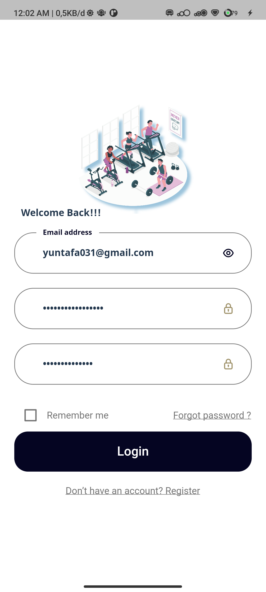

# 🌐 Gymhouse - Workout Routine Mobile-App

  

## 🎯 Project Description

Welcome to **Gymhouse**! 🚀  
Created by: **Group 7 - Student Amikom Purwokerto University**  
Level: **Beginner**

## 🚀 Project Goals
This project aims to equip you with the skills and knowledge needed to create and manage workout routines. By following international standards, you will learn about user data management and efficient workout implementation.

## 📚 Application Content

#### 1. **User Registration**  
   - **Description**: Users can register and create accounts to start their workout routines.

#### 2. **Routine Creation**  
   - **Description**: Users can create and manage customized workout routines.

#### 3. **Workout Reminders**  
   - **Description**: Reminder feature to help users stay on track with their workout schedules.

#### 4. **Progress Reports**  
   - **Description**: Users can view their workout progress through graphs and reports.

---

## 🏁 Evaluation

- **Final Exam**
- **Submission (Final Project)**: Build a fully functional application according to the learned criteria.

## ⏰ Duration
The total time required to complete this project is **3 Month**. Ready to embark on your fitness journey? Join now and enhance your skills! 🚀

## 📋 Project Criteria
1. **Application can register and log in**: Ensure users can create accounts and log in.
2. **Workout routines can be created and managed**: Implement features for creating and editing routines.
3. **Workout progress can be saved**: Implement data storage for user progress.
4. **Reminders can be set**: Implement reminders for each workout routine.
5. **Progress reports available**: Provide reports displaying user progress.

## 🌟 Project Features
- CRUD functionalities for routine management.
- User data validation.
- Responsive error handling for various scenarios.

## 💻 Technologies Used
- **Flutter**: Framework for mobile application development.
- **Firebase**: Service for authentication and data storage.
- **Postman**: Tool for testing APIs (if needed).

## ⚙️ Installation
1. Clone this repository: `git clone <repository-url>`
2. Navigate to the project directory: `cd gymhouse`
3. Install dependencies: `flutter pub get`
4. Run the application: `flutter run`

## 📝 License
This project is licensed under the MIT License. Please see the [LICENSE](LICENSE) file for more information.
